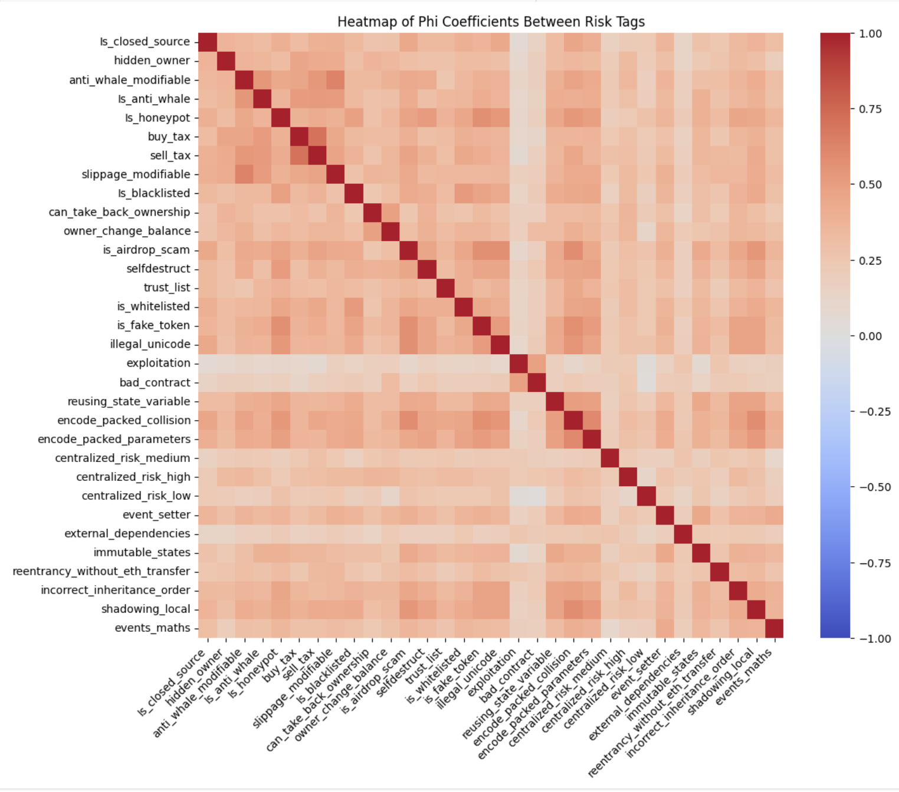

<h1> Correlation Analysis of Smart Contract Vulnerabilities </h1>

Objective: Create a visual representation of the correlation matrix to highlight potential relationships between different risk tags.  
 
Essential Terminology:
- __Smart Contract__: A self-executing program  stored on blockchain that automatically carries out an agreement when certain conditions are met without needing a middleman.  
  - For Example:  
    Let’s say you want to buy a digital artwork. A smart contract can be set up so that as soon as you send the payment, the artwork is automatically transferred to you. No need for a 
    third party like PayPal or a bank.
  - Smart contracts use cases are ever growing. They can be even used for something as simple as a pair of friends making a bet on which team will win a sports game.
   - Why Are They Important?  
     - No Middlemen → No banks, lawyers, or companies needed to enforce the contract
     - Transparent → Everyone can see how the contract works (no hidden rules)
     - Secure & Immutable → Once written on the blockchain, it can’t be changed or tampered with
   
- __Risk Tag__: Think of risk tags like warning labels on food—they alert you to potential dangers before you interact with a wallet or contract. These risk tags are provided by Webacy, a company that provides a security platform that helps protect crypto and NFT assets. There are a total of 32 risk_tags that we will be using. Each risk tag represents a different type of risk.
  - What do they detect?
    - Risks of a contract taking your funds through scam, hacks, or fraud
    - Hacking of your tokens
    - Suspicious activity such as involvement in shady transactions
    - Fake contracts mimicking legit ones

<h2> Step 1: Import the necassary libraries and load the dataset </h2>

__The libraries__:  
 
  &nbsp;&nbsp;&nbsp;&nbsp; - Pandas  
  &nbsp;&nbsp;&nbsp;&nbsp; - Numpy  
  &nbsp;&nbsp;&nbsp;&nbsp; - Matplotlib  
  &nbsp;&nbsp;&nbsp;&nbsp; - Seaborn  
  &nbsp;&nbsp;&nbsp;&nbsp; - Scipy  
  &nbsp;&nbsp;&nbsp;&nbsp; - networkx  
   

The dataset you will be using is a "__compiled_risk_dataset__". What exactly is in this dataset? This dataset contains 1094 entries of smart contract vulnerabilties. The first 3 columns contain essential information about the smart contract: the project name, the smart contract address, and the chain. The remaining columns are 32 potential risk tags that may be present in any given smart contract. The dataset is essentially a table that lists what specific risks are present in each contract. 
 
Download the dataset and save it into a pandas dataframe. Print the first five rive using the __.head()__ function.

<h2> Step 2: Create Fucntion to calculate correlations </h2>

How will we calcuate the correlations?  
 
We will use Phi coefficient which is specifically designed for binary data. The Phi Coefficient is a measure of the association between two binary variables. To calculate the Phi coefficient, we first need to establish a function that can handle this calculation. Create a function that can compute correlations of 2 binary variables.  
 
The following code creates a contengency table:  
 
&nbsp;&nbsp;&nbsp;&nbsp; __contingency_table = pd.crosstab(x, y)__  
 
The following code calculate the phi coefficient:  
 
&nbsp;&nbsp;&nbsp;&nbsp; __chi2 = scipy.stats.chi2_contingency(contingency_table, correction=False)[0]__  
&nbsp;&nbsp;&nbsp;&nbsp; __n = np.sum(np.sum(contingency_table))__  
&nbsp;&nbsp;&nbsp;&nbsp; __phi = np.sqrt(chi2 / n)__  

<h2> Step 3: Calculate Correlations </h2>

  1. First, we need to create an array called __risk_columns__ that will contain all of our risk tags.
  
  2. Load the array into a pandas dataframe

  3. Create a DataFrame to store Phi coefficients using the following code

&nbsp;&nbsp;&nbsp;&nbsp;&nbsp;&nbsp;&nbsp;&nbsp; __phi_matrix = pd.DataFrame(index=risk_df.columns, columns=risk_df.columns)__  

  4. Use the following code to calculate Phi coefficient for each pair of binary variables  
 
&nbsp;&nbsp;&nbsp;&nbsp;&nbsp;&nbsp;&nbsp;&nbsp; __for var1 in risk_df.columns:__  
&nbsp;&nbsp;&nbsp;&nbsp;&nbsp;&nbsp;&nbsp;&nbsp;&nbsp;&nbsp;&nbsp;&nbsp; __for var2 in risk_df.columns:__  
&nbsp;&nbsp;&nbsp;&nbsp;&nbsp;&nbsp;&nbsp;&nbsp;&nbsp;&nbsp;&nbsp;&nbsp;&nbsp;&nbsp;&nbsp;&nbsp; __phi_matrix.loc[var1, var2] = phi_coefficient(risk_df[var1], risk_df[var2])__  

<h2> Step 4: Visualization </h2>

Now it is time to visualize our analysis. Use the following code to create a heatmap:

&nbsp;&nbsp;&nbsp;&nbsp; __plt.figure(figsize=(12, 10)) # Setting the size of the plot__  
&nbsp;&nbsp;&nbsp;&nbsp; __sns.heatmap(phi_matrix.astype(float), annot=False, fmt=".2f", cmap='coolwarm', vmin=-1, vmax=1)__  
&nbsp;&nbsp;&nbsp;&nbsp; __plt.title('Heatmap of Phi Coefficients Between Risk Tags')__  
&nbsp;&nbsp;&nbsp;&nbsp; __plt.xticks(rotation=45, ha='right')__  
&nbsp;&nbsp;&nbsp;&nbsp; __plt.show()__  

Your heatmap should look like the following:

<h2> Findings </h2>

Positive correlations:  
1. buy_tax and sell_tax
2. encode_packed_parameters and encode_packed_collision
3. encode_packed_collision and is_airdrop_scam
4. illegal_unicode and is_airdrop_scam
5. anti_whale_modiafiable and slippage_modifiable
6. is_false_token and is_airdrop_scam
7. shadowing_local and is_airdrop_scam
8. shadowing_local and encode_packed_collision

Deeper insghts:

- "is_blacklisted" has a weak correlation with "is_honeypot". This may suggest that blacklisting mechanisms are not commonly seen in contracts that try to trap users.
- Since "is_honeypot" and "anti_whale_modifiable" are correlated, it may suggest that contracts implementing anti-whale mechanisms often include honeypot-like restrictions.
- The strogn correlation between "can_take_back_ownership" and "owner_change_balance" may indicate that contracts allowing ownership reversal often also have direct balance modification risks.
- "centralized_risk_high", "centralized_risk_medium", and "centralized_risk_low" might show strong intra-group correlations, indicating that centralization-related vulnerabilities frequently co-occur.
- "selfdestruct" and "trust_list" might correlate, meaning contracts using self-destruction mechanisms often implement allowlists. This can be a common issue amongst contracts that have both of these risk tags.

